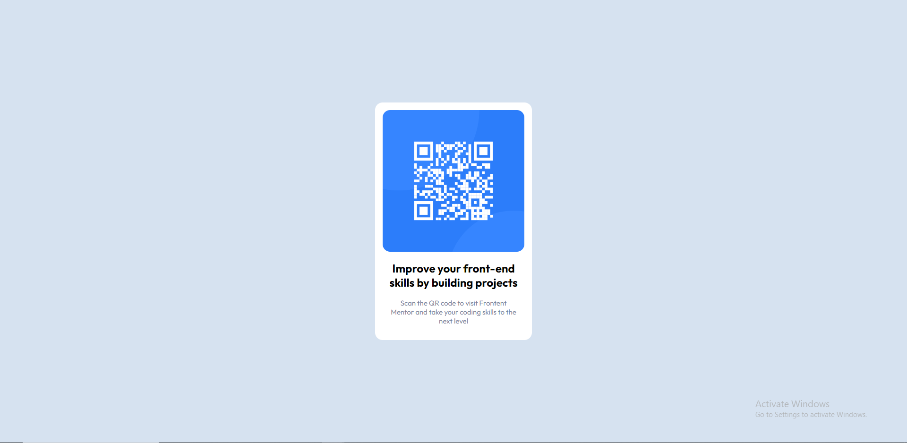

# Frontend Mentor - QR code component solution

This is a solution to the [QR code component challenge on Frontend Mentor](https://www.frontendmentor.io/challenges/qr-code-component-iux_sIO_H). Frontend Mentor challenges help you improve your coding skills by building realistic projects. 

## Table of contents

- [Overview](#overview)
  - [Screenshot](#screenshot)
  - [Links](#links)
- [My process](#my-process)
  - [Built with](#built-with)

- [Author](#author)

## Overview

### Screenshot

### Links

- Solution URL: [Source Code](https://github.com/purvasharmadev/frontend-mentor-one/blob/main/index.html)
- Live Site URL: [Live site](https://meek-hummingbird-caf2f1.netlify.app/)

## My process
started with HTML and then worked on styling.

### Built with

- Semantic HTML5 markup
- CSS custom properties
- Flexbox
- Mobile-first workflow

## Author

- Website - [Purva Sharma](https://purvasharma.netlify.app/)
- Frontend Mentor - [@purvasharmadev](https://www.frontendmentor.io/profile/purvasharmadev)
- Twitter - [@purva_sharma__ ](https://twitter.com/Purva_Sharma__)
